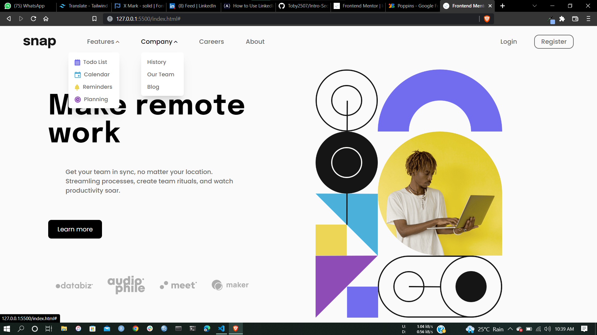
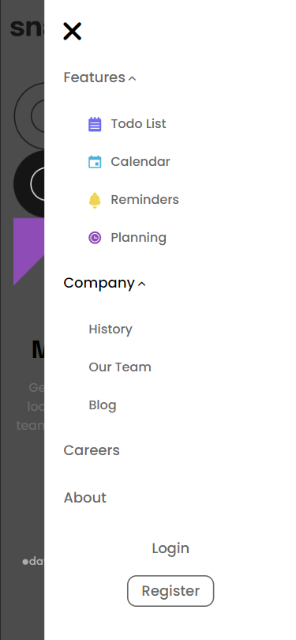

# Frontend Mentor - Intro section with dropdown navigation solution

This is a solution to the [Intro section with dropdown navigation challenge on Frontend Mentor](https://www.frontendmentor.io/challenges/intro-section-with-dropdown-navigation-ryaPetHE5). Frontend Mentor challenges help you improve your coding skills by building realistic projects.

## Table of contents

- [The challenge](#the-challenge)
- [Screenshot](#screenshot)
- [Links](#links)
- [Built with](#built-with)
- [What I learned](#what-i-learned)
- [Continued development](#continued-development)

### The challenge

Users should be able to:

- View the relevant dropdown menus on desktop and mobile when interacting with the navigation links
- View the optimal layout for the content depending on their device's screen size
- See hover states for all interactive elements on the page

### Screenshot

### Links

- [Solution URL](https://github.com/Toby2507/Intro-Section-with-Dropdown-Navigation)
- [Live site URL](https://toby2507.github.io/Intro-Section-with-Dropdown-Navigation/)

### Built with

- Semantic HTML5 markup
- Tailwindcss
- Flexbox
- CSS Grid
- Mobile-first workflow

### What I learned

This project was just another reminder of my HTML and CSS ways of displaying content and doing it with tailwindcss thereby making my code reuseable. And also the simplier use of Javascript.

### Continued development

I plan on doing one other FrontEndMentor challenge specifically one involving .json files to further my knowledge of async-await, classes and promises in javascript. Then I start learning React.
